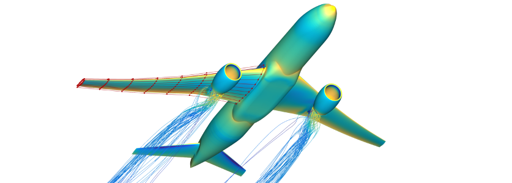

DAFoam: Discrete Adjoint with OpenFOAM
======================================



DAFoam contains a suite of discrete adjoint solvers for OpenFOAM. These adjoint solvers run as standalone executives to compute derivatives. DAFoam also has a Python interface that allows the adjoint solvers to interact with external modules for high-fidelity design optimization. DAFoam has the following features:

- It implements an efficient discrete adjoint approach with competitive speed, scalability, accuracy, and compatibility.
- It allows rapid discrete adjoint development for any steady-state OpenFOAM solvers with modifying only O(100) lines of source codes.
- It supports design optimizations for a wide range of disciplines such as aerodynamics, heat transfer, structures, hydrodynamics, and radiation.

Documentation
-------------

Refer to https://dafoamcode.readthedocs.io for DAFoam installation and tutorials.

To build the documentation locally, load the OpenFOAM environment, go to the **doc** folder, and run:

`./Allwmake`

The built documentation is located at **doc/DAFoamDoc.html**

Citation
--------

Ping He, Charles A. Mader, Joaquim R.R.A. Martins, Kevin J. Maki. An aerodynamic design optimization framework using a discrete adjoint approach with OpenFOAM. Computer & Fluids, 168:285-303, 2018. https://doi.org/10.1016/j.compfluid.2018.04.012

```
@article{DAFoamPaper,
	Author = {Ping He and Charles A. Mader and Joaquim R. R. A. Martins and Kevin J. Maki},
	Doi = {10.1016/j.compfluid.2018.04.012},
	Journal = {Computers \& Fluids},
	Pages = {285--303},
	Title = {An aerodynamic design optimization framework using a discrete adjoint approach with {OpenFOAM}},
	Volume = {168},
	Year = {2018}}
```

License
-------

Copyright 2019 MDO Lab

Distributed using the GNU General Public License (GPL), verstion 3; see the LICENSE file for details.
